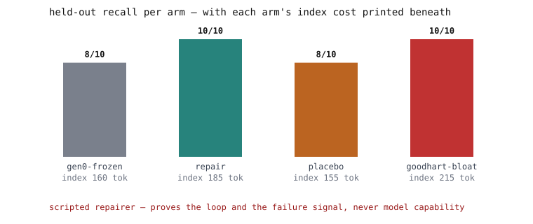

# memory-repair-lab



**The model never learns; the notes do.** A memory-repair loop built on the
memory layer of [wiki-memory-lab](https://github.com/LZBiala/wiki-memory-lab):
when a note can't be found, that miss is written down; a repair pass
relabels notes, each fix naming the miss that caused it; and results are
re-scored on a quiz **sealed in an envelope before any fixing began** -
plus a sugar-pill (placebo) arm, a re-check gate, and a published demo of
how the score can be gamed.

## What this is

**The model never learns; the notes do.** A small Python program (no API keys, so no online service) scores how findable a folder of plain-text notes is under one fixed word-matching rule, files each miss as a note, relabels each missed note citing the miss, and re-scores on second question wordings the repair step never sees. The repairer is a script, not an AI model.

## Why it matters

The finder reads only a note's name and one-line label (its "hook"), so a hook like "assorted notes" gives the finder nothing to match. An AI model that "learns" from the miss buries the fix in billions of numbers nobody can read; here the fix is one text line in the version history, its reason beside it.

## Try it in 60 seconds

```
git clone https://github.com/LZBiala/memory-repair-lab
cd memory-repair-lab
PYTHONPATH=src python -m repairlab demo
```

Needs Python 3.11+ and no packages. `PYTHONPATH=src` points Python at the code; in PowerShell: `$env:PYTHONPATH='src'; python -m repairlab demo`. Without it (or `pip install -e .`) Python reports "No module named repairlab".

## How it works

Picture a filing cabinet whose finder never opens a folder, only reads the tab: the note's name plus hook. It counts the words a question shares with the tab, skipping small words like "the" (name words count two, hook words one, no synonyms), and returns the top three scoring at least two. The town-history tab ("assorted notes") shares no word with either wording of its question, so it scores zero and never comes out.

Each question is written twice; only the first wording reaches the repair step, the second only the grader. The loop scores the first wordings, files each miss as a failure record (which question, which note, what came out instead), rewrites each missed note's hook from the note's own first line citing the record, and undoes any edit that breaks a first wording that was passing. Then the second wordings are graded; a check fails the run if any appears, word for word, in what the repair step was fed.

## The numbers, with their caveats

Quotes are the repo's words; an "arm" is one run variant. Held-out hits (second wordings): 8/10 before repair, 10/10 after one pass - "an upper bound by construction, never model capability": the gains are the two planted lazy hooks on ten notes the author wrote, in one run that repeats byte for byte (no spread to report). Placebo arm (same rewrite rule, the two alphabetically first notes, blind to failures): 8/10, unchanged - "the arm separates signal from motion, nothing more"; a control by construction, not a randomized one. A gamed arm that stuffs every hook with its whole note also scores 10/10, but its tab list grows to 215 proxy tokens (characters divided by four) against the repair arm's 185; that growth is the only price the demo measures. All of these regenerate from the demo; only "CI passes on GitHub" is asserted here.

## Where it loses

A scripted repairer "proves nothing about any model's ability to reflect". Held-out gains "are upper bounds on author-labeled fixtures" (the hand-written notes and questions in `fixtures/corpus.json`) and say nothing about other note sets. The repo declines the word "recursive" (repair rules that are themselves repairable notes) until that exists in code, as Loop 2.

## Try your own case

Add a note with a lazy hook, and a question with two wordings only it answers, to `fixtures/corpus.json`; rerun the demo and read `runs/repair-ledger.jsonl`. The tests pin today's numbers and will trip on purpose; use a git branch.

---

---

## For engineers

Everything below is the original technical README: the design, the measurements, and how to reproduce them.

> **Every measured number below regenerates in CI with zero API keys - if a
> claim drifts, the build fails.** (`pytest` → hygiene gate → full run →
> `git diff --exit-code`, Windows and Linux.) The repairer is a deterministic
> script: these numbers prove the *loop* and the value of the *failure
> signal*, never model capability. The hygiene gate itself bans this repo's
> tempting overclaims - CI refuses the marketing.

## The idea in 30 seconds

Imagine a recipe box that keeps a second stack of cards: every time a recipe
couldn't be found when dinner needed it, a **mistake-card** gets written saying
exactly what went wrong. Later, someone sits down with only those
mistake-cards and fixes the index tabs - better labels, citing the mistake
that demanded each fix. Then they re-test with a quiz **sealed in an envelope
before the fixing started**, so they can't fool themselves. The cook never
gets smarter - the box gets easier to use, every fix has its reason stapled to
it, and the envelope keeps everyone honest.

## In plain English

The mistake-cards above, scored: finding notes went from 8 out of 10 to 10 out
of 10 after one repair round, graded on the quiz sealed before any fixing
began. The proof it wasn't luck: a sugar-pill run made the same number of
edits without reading the mistake-cards and stayed at 8 out of 10 - the
failure reports did the work, not the busywork. Every accepted fix names the
exact mistake that caused it, and the repo says out loud what it does not
prove.

## The agentic graph

A few separate jobs take turns tending one shared box of notes - and every
hand-off between them is a plain file you can open in an editor:

```
MEMORY (wiki notes) --index--> EVALUATOR --misses--> FAILURE RECORDS
FAILURE RECORDS --citations--> REPAIRER --candidate edits--> GATES
GATES (regression replay + citation check) --accepted diffs--> MEMORY
```

Family rules apply: roles are structurally separated; the repairer may read
ONLY failure records and target note bodies (**a test asserts held-out task
text never enters its input**); the gates alone decide what lands; and the
ledger refuses any edit without a written reason *and* a citation. The
placebo arm runs the same budget with the failure-record edge **cut** -
separating "the failure signal helps" from "any editing helps."

## Quickstart (no keys)

```
git clone https://github.com/LZBiala/memory-repair-lab
cd memory-repair-lab
pip install -e .          # installs nothing but this package - runtime is stdlib-only
python -m repairlab demo
```

Watch generation 0 miss the two lazy-hook notes, the failures get filed, the
cited repairs land through the gate, and the held-out re-measurement - then
open `runs/repair-ledger.jsonl` and read every decision with its reason.

## The star patient

The fixture wiki inherits its parent's most famous defect: a note whose hook
is just `assorted notes`. Generation 0 cannot retrieve it - the hook gives
the scorer nothing. The repairer, reading only the failure record and the
note's own body, rewrites the hook **from the note's first line** (content-
derived, never copied from the visible question - so the held-out phrasing
can only be won by genuinely better metadata). One generation later, both
phrasings retrieve it. The fix is a one-line diff citing `fail-t09`, in the
open, in the ledger.

## Claims, retested on every change (SLO-style)

Rendered from `metrics.jsonl` by `report.py` - no measured number below is
typed by hand, and CI fails if regeneration disagrees.

<!-- AUTOGEN:BEGIN - rendered by report.py from metrics.jsonl; do not edit by hand -->

| claim | number (regenerated by CI) | how measured | honest caveat |
|---|---|---|---|
| Cited repairs improve HELD-OUT recall | **8/10 → 10/10 held-out hits (precision 0.80 → 0.83) after one repair generation** | held-out phrasings sealed before generation zero (repair-visible = the fit split); a test asserts they never enter repairer input; frozen gen-0 replayed in the same run | scripted repairer on author-labeled fixtures - proves the loop, an upper bound by construction, never model capability |
| The failure signal - not editing - does the work | **placebo arm (same edit budget, blind): 8/10 - unchanged from gen-0** | identical budget; placebo edits computed without reading failure records | one corpus, one deterministic churn rule; the arm separates signal from motion, nothing more |
| Every accepted edit cites its failure record | **2 accepted edits, 2/2 cited; 0 reverted by the regression gate** | the protocol refuses uncited edits; the full suite replays after every acceptance | conformance of the loop, labeled as such |
| Gaming recall has a visible price (the Goodhart demo) | **hook-bloat arm: 10/10 held-out hits at index cost 215 tok vs repair arm 10/10 at 185 tok** | an authored strategy committed and measured beside the honest one; proxy tokens = chars/4 | a demonstration of a failure mode, not evidence any real improver behaves this way |
| One repair generation, stated as such | **stop label: no remaining repair-visible failures after generation 1** | the demo runs exactly ONE repair pass by construction; the label distinguishes done from budget-exhausted | 'termination' here is structural, not an enforced property - a real multi-generation loop with a K-cycle no-gain stop is Loop 2 work |

<!-- AUTOGEN:END -->

Regenerate everything yourself: `python -m repairlab demo --quiet && git diff`.

## Verification the worker cannot skip

Three gates stand between a candidate edit and the wiki: the regression
replay (every accepted edit re-runs the full suite), the citation check (an
edit that cannot name the failure record that motivated it does not land),
and the sealed held-out wall (the re-measurement uses phrasings frozen
before generation zero). None of them ask the repairer to be trustworthy -
they ask it to survive being checked. That is the pattern worth naming:
build the tools that verify the work, rather than trust the worker to have
done it well. The 8/10 → 10/10 held-out gain above is what one repair pass
looks like once it has to clear all three gates. The placebo arm is the
control that tells you what the gates alone are worth - same budget, same
churn, failure records withheld, and it stays flat at 8/10: the placebo arm
shows the FAILURE SIGNAL, not the churn, carries the value. The gates do not
manufacture that gain; they only make sure nothing gets credit for it that
did not earn it.

## What this does NOT show

The repairer is a deterministic rule. A scripted repairer fixing planted-style
failures proves that **the loop works and the failure signal carries value**
(the placebo arm, same budget and blind, fixes nothing) - it proves nothing
about any model's ability to reflect. "Recursive" in the strict sense -
repair policies that are themselves notes subject to repair - is **Loop 2**,
documented future work, not marketed until it exists in code. Held-out gains
here are upper bounds on author-labeled fixtures; a plateau on this corpus
says nothing about other corpora; and the model's weights never change - every
gain is attributable to a diffable text artifact in `git log -p`.

## Bring your own repairer (v1.1 seam)

The `repair()` seam accepts any function from failure records to cited edits.
A live-model repairer's results belong on dated pages with run counts and
variance - **never in this README**. Watch for: citation discipline (an edit
that can't name its failure is a guess), the regression gate (models love
collateral edits), and the held-out wall (echoing the visible question into a
hook is memorization wearing a fix's clothes).

## The family stack

Memory layer ([wiki-memory-lab](https://github.com/LZBiala/wiki-memory-lab)) →
evaluation layer ([agent-mutation-lab](https://github.com/LZBiala/agent-mutation-lab)) →
decision-calibration layer ([adversarial-chambers](https://github.com/LZBiala/adversarial-chambers)) →
**this repo: the control loop that closes over the memory layer.** An
architecture map, not a benchmark. Same laws everywhere: committed artifacts
ARE the claims; losses publish above the fold; every deletion carries its
reason.

## Repo map, tests, CI

```
src/repairlab/    corpus (notes/index/scorer), loop (failures, repair, placebo, gates), report
fixtures/         corpus.json - 10 Milldale notes (2 lazy hooks) + 10 task pairs (visible/held-out)
wiki/ runs/ report/ metrics.jsonl   - generated artifacts, committed on purpose
tests/            loop contracts (citation, held-out wall, placebo blindness, gate probe), determinism
tools/            blocklist_check.py - hygiene gate (first commit; bans this repo's own overclaims)
docs/             the interactive walkthrough page
```

CI: pytest → hygiene gate → full regeneration → `git diff --exit-code`,
Windows + Linux, pinned Python, zero secrets.

## Field notes (2026)

In research terms the placebo arm is a control group, and the sealed quiz
answers a known worry (the "Oracle ceiling"): finding the right note does
not guarantee acting on it correctly. Public
surveys of memory frameworks (further reading:
[a survey of agent memory frameworks](https://www.graphlit.com/blog/survey-of-ai-agent-memory-frameworks))
show controlled repair trials remain rare; this repo is a minimal,
fully-regenerable instance.

## Roadmap

Future work - stated as such, none of it in code yet:

- **Oracle-ceiling experiment:** measure whether repaired notes change
  downstream *actions*, not just retrieval hits. Any live-model runs will be
  published as a separate, labeled study with k-run variance - never inside
  the CI-gated claims above.
- **Pre/post context evals:** lint and clarity checks around each repair, so
  repair quality is instrumented, not assumed.

## License

MIT.
